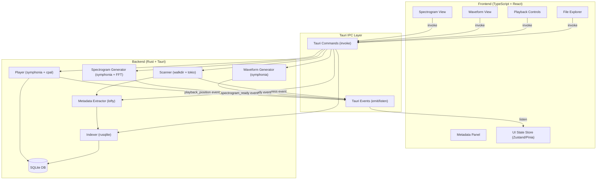

# Design Document: music-file-explorer - neptune

## Overview

The music-file-explorer also named Neptune is a cross-platform desktop application built with Tauri (Rust backend + TypeScript/React frontend). It provides library scanning, metadata extraction, audio playback, and audio visualization (waveform + spectrogram) for local music collections.

The architecture follows a clear separation between the Rust backend (heavy computation, I/O, audio) and the TypeScript frontend (UI rendering, user interaction). Communication happens exclusively through Tauri's IPC command/event system. All persistent state lives in a local SQLite database.

Key design decisions:
- **Rust for all audio work**: decoding, playback, waveform/spectrogram computation run in Rust to avoid JS performance limits.
- **Async-first backend**: `tokio` drives all I/O-bound operations (scanning, DB writes) to keep the UI responsive.
- **Incremental data delivery**: large results (scan progress, waveform chunks) are streamed to the frontend via Tauri events rather than returned as single large payloads.
- **SQLite as the single source of truth**: the library, track metadata, and app state all live in one embedded database.
- **Professional dark UI**: the interface uses a dark theme anchored to a purple/indigo palette (`#6366f1` primary) for a polished, music-tool aesthetic.

---

## Visual Design System

### Branding

The application logo is `logo.svg`, located at `src/assets/logo.svg`. It is displayed in:
- The window title bar (16×16 favicon variant)
- The sidebar header (32×32, next to the app name "Music Explorer")
- The about/splash screen (full size)

The logo SVG uses `currentColor` so it inherits the active theme's primary color (`#6366f1`) without requiring separate light/dark variants.

### Color Palette

The UI is built on a dark theme. All color tokens are defined as CSS custom properties in `src/styles/tokens.css` and consumed throughout the component tree.

| Token | Value | Usage |
|---|---|---|
| `--color-primary` | `#6366f1` | Active states, accent highlights, waveform fill, seek cursor |
| `--color-primary-hover` | `#818cf8` | Button hover, interactive element hover |
| `--color-primary-muted` | `#3730a3` | Subtle backgrounds, selected row tint |
| `--color-bg-base` | `#0f0f13` | Main window background |
| `--color-bg-surface` | `#18181f` | Sidebar, panels, cards |
| `--color-bg-elevated` | `#22222d` | Dropdowns, modals, tooltips |
| `--color-border` | `#2e2e3d` | Dividers, panel borders |
| `--color-text-primary` | `#f1f1f5` | Primary labels, track titles |
| `--color-text-secondary` | `#9898b0` | Artist names, timestamps, secondary info |
| `--color-text-muted` | `#55556a` | Placeholder text, disabled states |
| `--color-error` | `#f87171` | Error badges, missing track indicators |
| `--color-success` | `#34d399` | Scan complete, indexed count |
| `--color-waveform-fill` | `#6366f1` | Waveform amplitude bars |
| `--color-waveform-played` | `#818cf8` | Waveform portion already played |
| `--color-waveform-bg` | `#18181f` | Waveform canvas background |

### Typography

- Font family: `Inter` (variable font, loaded via `@fontsource/inter`)
- Base size: `14px` / `1rem`
- Track titles: `0.9375rem`, weight `500`, `--color-text-primary`
- Artist / album: `0.8125rem`, weight `400`, `--color-text-secondary`
- Timestamps / labels: `0.75rem`, weight `400`, `--color-text-muted`
- Monospace (file paths): `JetBrains Mono`, `0.8125rem`

### Layout

The app uses a three-column layout:

```
┌─────────────────────────────────────────────────────────┐
│  [logo] Music Explorer          [search]        [⚙]     │  ← TitleBar (40px)
├──────────────┬──────────────────────────┬────────────────┤
│              │                          │                │
│  Sidebar     │   File Explorer          │  Metadata      │
│  (220px)     │   (flex-grow)            │  Panel (280px) │
│              │                          │                │
│  - Library   │   Directory tree /       │  Cover art     │
│  - Folders   │   Track list             │  Tags          │
│  - Settings  │                          │  Properties    │
│              │                          │                │
├──────────────┴──────────────────────────┴────────────────┤
│  Waveform / Spectrogram View                (120px)      │
├─────────────────────────────────────────────────────────┤
│  Playback Controls bar                       (64px)      │
└─────────────────────────────────────────────────────────┘
```

### Component Visual Specifications

**Sidebar**: `--color-bg-surface` background, `--color-border` right border. Logo + app name at top. Navigation items use `--color-primary` left-border indicator when active.

**File Explorer rows**: `48px` height. Hover: `--color-bg-elevated`. Selected: `--color-primary-muted` background + `--color-primary` left border (3px). Missing tracks: `--color-error` warning icon + muted text.

**Playback Controls bar**: `--color-bg-surface` background, `--color-border` top border. Play/pause button uses `--color-primary` fill with `--color-bg-base` icon. Seek slider track: `--color-border`; filled portion: `--color-primary`. Volume knob: same scheme.

**Waveform View**: Canvas with `--color-waveform-bg` background. Unplayed bars: `--color-waveform-fill` at 70% opacity. Played bars: `--color-waveform-played`. Playback cursor: 2px solid `--color-primary`.

**Spectrogram View**: Canvas rendered with the `inferno` color map (black → purple → orange → yellow). The `--color-primary` hue anchors the mid-range of the color scale for visual consistency with the rest of the UI.

**Modals / Toasts**: `--color-bg-elevated` background, `1px solid --color-border` border, `8px` border-radius, `box-shadow: 0 8px 32px rgba(0,0,0,0.6)`. Primary action button: `--color-primary` background.

---

## Architecture



---

## Components and Interfaces

### Tauri Commands (Backend → Frontend API)

```rust
// Library scanning
#[tauri::command] async fn scan_directory(path: String) -> Result<ScanResult, AppError>
#[tauri::command] async fn get_library() -> Result<Vec<Track>, AppError>
#[tauri::command] async fn get_directory_tree(path: Option<String>) -> Result<Vec<DirNode>, AppError>

// Metadata
#[tauri::command] async fn get_track_metadata(track_id: i64) -> Result<TrackMetadata, AppError>
#[tauri::command] async fn get_cover_art(track_id: i64) -> Result<Option<Vec<u8>>, AppError>

// Playback
#[tauri::command] async fn play_track(track_id: i64) -> Result<(), AppError>
#[tauri::command] async fn pause() -> Result<(), AppError>
#[tauri::command] async fn stop() -> Result<(), AppError>
#[tauri::command] async fn seek(position_secs: f64) -> Result<(), AppError>
#[tauri::command] async fn set_volume(level: f32) -> Result<(), AppError>
#[tauri::command] async fn play_next() -> Result<(), AppError>
#[tauri::command] async fn play_previous() -> Result<(), AppError>

// Visualization
#[tauri::command] async fn get_waveform(track_id: i64) -> Result<WaveformData, AppError>
#[tauri::command] async fn get_spectrogram(track_id: i64, fft_size: Option<u32>, hop_size: Option<u32>) -> Result<SpectrogramData, AppError>

// State
#[tauri::command] async fn get_app_state() -> Result<AppState, AppError>
#[tauri::command] async fn save_app_state(state: AppState) -> Result<(), AppError>
#[tauri::command] async fn reset_library() -> Result<(), AppError>
```

### Tauri Events (Backend → Frontend push)

| Event Name | Payload | Description |
|---|---|---|
| `scan_progress` | `{ files_found: u32, current_dir: String, complete: bool }` | Emitted during scanning |
| `playback_position` | `{ position_secs: f64, duration_secs: f64 }` | Emitted every ≤500ms during playback |
| `playback_state_changed` | `{ state: "playing" \| "paused" \| "stopped", track_id: Option<i64> }` | Emitted on state transitions |
| `waveform_ready` | `{ track_id: i64 }` | Emitted when waveform computation finishes |
| `spectrogram_ready` | `{ track_id: i64 }` | Emitted when spectrogram computation finishes |

### Frontend Components

**FileExplorer**: Renders the directory tree using a virtualized list (react-window or vue-virtual-scroller). Handles keyboard navigation (arrow keys, Enter). Exposes a search input that filters tracks client-side.

**MetadataPanel**: Subscribes to track selection events. Calls `get_track_metadata` and `get_cover_art` on selection. Renders all tag fields and cover art.

**WaveformView**: Calls `get_waveform` on track selection. Renders amplitude data on an HTML Canvas. Draws a playback cursor that advances via `playback_position` events. Click-to-seek calls `seek`.

**SpectrogramView**: Calls `get_spectrogram` on activation. Renders the time-frequency heatmap on Canvas using a viridis/inferno color map. Click-to-seek calls `seek`.

**PlaybackControls**: Binds to playback commands. Displays position/duration from `playback_position` events.

---

## Data Models

### Database Schema (SQLite)

```sql
CREATE TABLE tracks (
    id          INTEGER PRIMARY KEY AUTOINCREMENT,
    path        TEXT NOT NULL UNIQUE,
    dir_path    TEXT NOT NULL,
    filename    TEXT NOT NULL,
    title       TEXT,
    artist      TEXT,
    album       TEXT,
    album_artist TEXT,
    year        INTEGER,
    genre       TEXT,
    track_number INTEGER,
    disc_number  INTEGER,
    duration_secs REAL,
    cover_art_path TEXT,   -- path to extracted cover art file in app cache dir
    missing     INTEGER NOT NULL DEFAULT 0,  -- 1 if file no longer on disk
    indexed_at  INTEGER NOT NULL             -- Unix timestamp
);

CREATE INDEX idx_tracks_dir ON tracks(dir_path);
CREATE INDEX idx_tracks_artist ON tracks(artist);
CREATE INDEX idx_tracks_album ON tracks(album);

CREATE TABLE app_state (
    key   TEXT PRIMARY KEY,
    value TEXT NOT NULL
);
-- Keys: "last_track_id", "last_position_secs", "volume", "root_directories"
```

### Rust Types

```rust
#[derive(Debug, Clone, Serialize, Deserialize)]
pub struct Track {
    pub id: i64,
    pub path: String,
    pub dir_path: String,
    pub filename: String,
    pub title: Option<String>,
    pub artist: Option<String>,
    pub album: Option<String>,
    pub album_artist: Option<String>,
    pub year: Option<i32>,
    pub genre: Option<String>,
    pub track_number: Option<u32>,
    pub disc_number: Option<u32>,
    pub duration_secs: Option<f64>,
    pub cover_art_path: Option<String>,
    pub missing: bool,
}

#[derive(Debug, Clone, Serialize, Deserialize)]
pub struct DirNode {
    pub path: String,
    pub name: String,
    pub children: Vec<DirNode>,
    pub tracks: Vec<Track>,
}

#[derive(Debug, Clone, Serialize, Deserialize)]
pub struct WaveformData {
    pub track_id: i64,
    pub samples_per_channel: Vec<f32>,  // downsampled peak amplitudes, one per pixel column
    pub channels: u16,
    pub duration_secs: f64,
}

#[derive(Debug, Clone, Serialize, Deserialize)]
pub struct SpectrogramData {
    pub track_id: i64,
    pub magnitudes: Vec<Vec<f32>>,  // [time_frame][freq_bin], values in dB
    pub fft_size: u32,
    pub hop_size: u32,
    pub sample_rate: u32,
    pub duration_secs: f64,
}

#[derive(Debug, Clone, Serialize, Deserialize)]
pub struct AppState {
    pub last_track_id: Option<i64>,
    pub last_position_secs: f64,
    pub volume: f32,
    pub root_directories: Vec<String>,
}

#[derive(Debug, Clone, Serialize, Deserialize)]
pub struct ScanResult {
    pub total_found: u32,
    pub total_indexed: u32,
    pub total_updated: u32,
    pub total_missing: u32,
}

#[derive(Debug, thiserror::Error, Serialize)]
pub enum AppError {
    #[error("IO error: {0}")]
    Io(String),
    #[error("Database error: {0}")]
    Database(String),
    #[error("Decode error: {0}")]
    Decode(String),
    #[error("Track not found: {0}")]
    TrackNotFound(i64),
    #[error("Unsupported format: {0}")]
    UnsupportedFormat(String),
}
```


## Correctness Properties

*A property is a characteristic or behavior that should hold true across all valid executions of a system — essentially, a formal statement about what the system should do. Properties serve as the bridge between human-readable specifications and machine-verifiable correctness guarantees.*

### Property 1: Scanner returns exactly supported-format files

*For any* directory tree containing a mix of supported and unsupported file extensions, the Scanner SHALL return exactly the set of files whose extensions match a Supported_Format — no more, no fewer — and SHALL NOT return an error for unsupported files.

**Validates: Requirements 1.1, 1.4**

---

### Property 2: Scan-then-query round trip

*For any* set of audio files in a directory, after a scan completes, querying the database SHALL return a track entry for every discovered file path, with no entries omitted.

**Validates: Requirements 1.3**

---

### Property 3: Missing files are marked, present files are not

*For any* indexed library where a random subset of track files is deleted from disk, a subsequent rescan SHALL mark exactly the deleted tracks as `missing = true` and leave all remaining tracks as `missing = false`.

**Validates: Requirements 1.5**

---

### Property 4: Rescan is idempotent — no duplicates, new files added

*For any* already-indexed directory, rescanning SHALL NOT create duplicate track entries for existing files, and SHALL add entries for any newly added files.

**Validates: Requirements 1.6**

---

### Property 5: Metadata extraction round trip with partial tags

*For any* audio file containing any subset of the supported tag fields (title, artist, album, album_artist, year, genre, track_number, disc_number, duration), the Metadata_Extractor SHALL return the correct value for each present field and `null` for each absent field, without failing.

**Validates: Requirements 2.1, 2.3**

---

### Property 6: Cover art round trip

*For any* audio file with embedded cover art of any image content, the Metadata_Extractor SHALL extract the image data and set a non-null `cover_art_path` in the track record.

**Validates: Requirements 2.2**

---

### Property 7: Tag format support

*For any* supported tag format (ID3v1, ID3v2, Vorbis Comment, MP4/iTunes atoms, FLAC metadata blocks) and any valid tag values written in that format, the Metadata_Extractor SHALL successfully read and return those values.

**Validates: Requirements 2.5**

---

### Property 8: Folder expansion shows all children

*For any* directory node in the File_Explorer tree, expanding that node SHALL display all immediate child folders and all tracks directly within that folder — no children omitted.

**Validates: Requirements 3.2**

---

### Property 9: Track selection loads correct metadata

*For any* track in the library, selecting it in the File_Explorer SHALL cause the Metadata_Panel to display metadata that exactly matches the stored record for that track.

**Validates: Requirements 3.3**

---

### Property 10: Search filter is complete and case-insensitive

*For any* track list and any search query string, the filtered result SHALL contain exactly those tracks where the title, artist, or album contains the query string (case-insensitive) — no false positives and no false negatives.

**Validates: Requirements 3.6, 3.7**

---

### Property 11: Playback succeeds for all supported formats

*For any* audio file in a Supported_Format, invoking `play_track` SHALL return `Ok(())` and transition the player to the "playing" state.

**Validates: Requirements 4.4**

---

### Property 12: Decode errors are isolated

*For any* corrupt or undecodable file, invoking `play_track` SHALL return `AppError::Decode` and SHALL NOT change the application's playback state or crash the process.

**Validates: Requirements 4.5**

---

### Property 13: Waveform output length matches requested width

*For any* audio file and any requested pixel width W, the Waveform_Generator SHALL return a `samples_per_channel` vector of length exactly W.

**Validates: Requirements 5.1**

---

### Property 14: Click-to-seek position mapping

*For any* normalized click position p ∈ [0.0, 1.0] on either the Waveform_View or Spectrogram_View, the resulting seek position SHALL equal `p × duration_secs` (within floating-point tolerance).

**Validates: Requirements 5.4, 6.4**

---

### Property 15: Spectrogram output dimensions match FFT parameters

*For any* audio file with N total samples, FFT window size F, and hop size H, the Spectrogram_Generator SHALL return a magnitudes array with `ceil((N - F) / H)` time frames and `F / 2 + 1` frequency bins.

**Validates: Requirements 6.1**

---

### Property 16: Library persistence round trip

*For any* library state (set of tracks), persisting to SQLite and then reloading SHALL produce an identical set of track records.

**Validates: Requirements 7.2**

---

### Property 17: Adding a root directory is additive

*For any* existing library L and any new root directory D containing tracks T, after adding D, the library SHALL contain all tracks from L plus all tracks from T, with no tracks from L removed.

**Validates: Requirements 7.3**

---

### Property 18: App state persistence round trip

*For any* valid app state (last_track_id, last_position_secs, volume), saving and then reloading SHALL restore exactly those values.

**Validates: Requirements 7.4**

---

### Property 19: Path normalization uses OS-native separator

*For any* file path string (regardless of which separator characters it contains), the path normalization function SHALL return a path using the OS-native separator.

**Validates: Requirements 8.3**

---

## Error Handling

### Backend Error Strategy

All Tauri commands return `Result<T, AppError>`. The `AppError` enum is serialized to JSON and forwarded to the frontend. The frontend maps each variant to an appropriate UI notification.

| Error Variant | Trigger | Frontend Behavior |
|---|---|---|
| `AppError::Io` | File not found, permission denied | Toast notification with path |
| `AppError::Database` | SQLite read/write failure | Modal with reset option |
| `AppError::Decode` | Corrupt or unsupported audio data | Inline error in track row |
| `AppError::TrackNotFound` | Stale track_id reference | Refresh library view |
| `AppError::UnsupportedFormat` | Format not in symphonia's codec list | Toast notification |

### Specific Error Scenarios

**Database corruption (Req 7.5)**: On startup, if the DB open fails, the app displays a modal: "Library database could not be read. Reset to empty library?" with Reset / Cancel options. Reset deletes the DB file and creates a fresh one.

**Scan interruption**: If the scanner encounters a permission-denied error on a subdirectory, it logs the error and continues scanning other directories. The final `ScanResult` includes a count of skipped directories.

**Playback failure**: If `play_track` returns `AppError::Decode`, the player stays in the stopped state. The UI shows an inline error badge on the track row. The user can still navigate and play other tracks.

**Missing tracks**: Tracks marked `missing = true` are shown in the File_Explorer with a visual indicator (e.g., strikethrough or warning icon). Attempting to play a missing track returns `AppError::Io` immediately without attempting decode.

---

## Testing Strategy

### Dual Testing Approach

Both unit/example tests and property-based tests are used. Unit tests cover specific scenarios, integration points, and error conditions. Property tests verify universal correctness across randomized inputs.

### Property-Based Testing

The Rust backend uses **proptest** (crates.io/crates/proptest) for property-based testing. Each property test runs a minimum of 100 iterations.

Each test is tagged with a comment referencing the design property:
```rust
// Feature: neptune, Property 1: Scanner returns exactly supported-format files
```

Key property test areas:
- Scanner file filtering (Properties 1, 2, 3, 4)
- Metadata extraction round trips (Properties 5, 6, 7)
- Search filter correctness (Property 10)
- Waveform/spectrogram output dimensions (Properties 13, 15)
- Click-to-seek mapping (Property 14)
- DB persistence round trips (Properties 16, 17, 18)
- Path normalization (Property 19)

For audio-processing properties (waveform, spectrogram), proptest generates synthetic PCM sample buffers rather than real audio files to keep tests fast and deterministic.

### Unit / Example Tests

- File_Explorer renders folder nodes and tracks (Req 3.1)
- Keyboard navigation moves focus correctly (Req 3.4)
- Playback controls invoke correct Tauri commands (Req 4.6)
- Waveform cursor advances with playback events (Req 5.3)
- Loading indicators shown during async computation (Req 5.6, 6.6)
- Spectrogram color map maps dB range to color scale (Req 6.3)
- DB corruption triggers reset modal (Req 7.5)
- Native file picker is invoked for directory selection (Req 8.4)

### Integration Tests

- Scan performance: 10,000 files within 60 seconds (Req 1.7)
- Metadata display latency: < 100ms after track selection (Req 2.4)
- Seek latency: < 200ms (Req 4.3)
- Waveform render time: < 2 seconds for 10-minute file (Req 5.2)
- Waveform compute time: < 1 second for 3-minute file (Req 5.5)
- Spectrogram compute time: < 3 seconds for 3-minute file (Req 6.5)
- Playback uninterrupted during File_Explorer navigation (Req 4.7)
- cpal default device selection on each platform (Req 8.2)

### Smoke Tests

- App builds on Windows 10+, macOS 12+, Ubuntu 22.04+ (Req 8.1)
- SQLite database created in app data directory on first run (Req 7.1)
