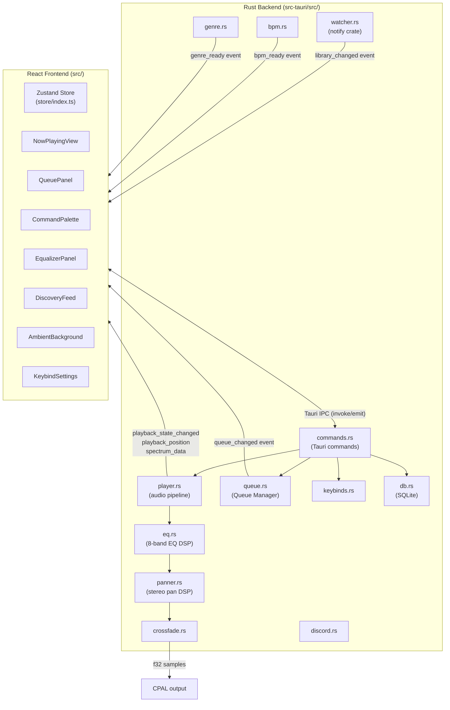

# Design Document: Neptune Feature Expansion

## Overview

This document describes the technical design for fourteen new features added to Neptune, a Tauri 2 + React 18 + Rust desktop music player. The features span four themes:

- **Library Intelligence**: Folder Watching, Auto BPM Detection, Genre Detection
- **Playback Enhancement**: Queue/Playlist Management, Gapless Playback/Crossfade, 8-Band Equalizer, Panning Control
- **UI/UX Enrichment**: Now Playing View, Keyboard Shortcuts, Command Palette, Ambient Background, Drag-and-Drop Reordering, Discovery Feed
- **System Integration**: Discord Rich Presence

The existing codebase provides: library scanning (`scanner.rs`), SQLite persistence (`db.rs`), audio decoding and CPAL output (`player.rs`), metadata extraction (`metadata.rs`), waveform/spectrogram generation, and a React frontend with Zustand state management.

All new Rust code lives in `src-tauri/src/`. All new React code lives in `src/components/` and `src/store/`. New Tauri commands are registered in `src-tauri/src/lib.rs`.

---

## Architecture

### High-Level System Diagram



### Audio Pipeline

The audio pipeline is a linear chain of DSP stages inside the player background thread:

```
Symphonia decoder
      |
      v
[EQ: 8-band biquad filters]
      |
      v
[Panner: constant-power stereo pan]
      |
      v
[Crossfader: fade-out current / fade-in next]
      |
      v
CPAL output ring buffer
```

Each DSP stage is a Rust struct implementing a `process(&mut self, samples: &mut [f32])` method. The player loop calls each stage in sequence after decoding each packet.

### State Management

New Zustand slices are added to the existing store:

| Slice | State |
|---|---|
| `queue` | `queueTrackIds: number[]`, `currentQueueIndex: number` |
| `eq` | `eqGains: number[8]`, `eqBypassed: boolean` |
| `pan` | `panValue: number` |
| `crossfade` | `crossfadeSecs: number`, `gaplessEnabled: boolean` |
| `keybinds` | `keybindMap: Record<string, string>` |
| `discovery` | `recommendations: Track[]` |
| `ambientBg` | `enabled: boolean`, `currentArtUrl: string \| null` |
| `discordPresence` | `enabled: boolean` |

### New Tauri Events

| Event | Payload | Emitter |
|---|---|---|
| `library_changed` | `{}` | `watcher.rs` |
| `queue_changed` | `{ queue: number[], current_index: number }` | `queue.rs` |
| `bpm_ready` | `{ track_id: number, bpm: number \| null }` | `bpm.rs` |
| `genre_ready` | `{ track_id: number, genre: string }` | `genre.rs` |

### New Cargo Dependencies

```toml
notify = "6"                    # filesystem watching
discord-rich-presence = "2"     # Discord IPC
rayon = "1"                     # background thread pool for BPM/genre
```

### New npm Dependencies

```json
"@dnd-kit/core": "^6",
"@dnd-kit/sortable": "^8",
"fuse.js": "^7"
```

---

## Components and Interfaces

### Rust: `watcher.rs`

```rust
pub struct Watcher {
    _watcher: notify::RecommendedWatcher,
}

impl Watcher {
    pub fn start(app_handle: AppHandle) -> Result<Self, AppError>;
    pub fn add_directory(&self, path: &str) -> Result<(), AppError>;
    pub fn remove_directory(&self, path: &str) -> Result<(), AppError>;
}
```

Uses `notify::recommended_watcher` with a debounce of 500 ms. On each event, opens a DB connection, calls the appropriate `db::` function, then emits `library_changed`.

### Rust: `queue.rs`

```rust
pub struct QueueManager {
    queue: Arc<Mutex<QueueState>>,
    app_handle: AppHandle,
}

#[derive(Clone, Serialize, Deserialize)]
pub struct QueueState {
    pub track_ids: Vec<i64>,
    pub current_index: Option<usize>,
}

impl QueueManager {
    pub fn new(app_handle: AppHandle) -> Self;
    pub fn load_from_db(&self) -> Result<(), AppError>;
    pub fn add_to_end(&self, track_id: i64) -> Result<(), AppError>;
    pub fn add_next(&self, track_id: i64) -> Result<(), AppError>;
    pub fn remove(&self, index: usize) -> Result<(), AppError>;
    pub fn move_track(&self, from: usize, to: usize) -> Result<(), AppError>;
    pub fn clear(&self) -> Result<(), AppError>;
    pub fn shuffle_after_current(&self) -> Result<(), AppError>;
    pub fn advance(&self) -> Result<Option<i64>, AppError>;
    pub fn state(&self) -> QueueState;
    fn persist(&self) -> Result<(), AppError>;
    fn emit_changed(&self);
}
```

### Rust: `eq.rs`

```rust
pub struct Equalizer {
    bands: [BiquadFilter; 8],
    gains_db: [f32; 8],
    bypassed: bool,
    sample_rate: u32,
}

struct BiquadFilter {
    b0: f32, b1: f32, b2: f32,
    a1: f32, a2: f32,
    x1: f32, x2: f32,
    y1: f32, y2: f32,
}

impl Equalizer {
    pub const CENTER_FREQS: [f32; 8] = [60.0, 170.0, 310.0, 600.0, 1000.0, 3000.0, 6000.0, 14000.0];
    pub fn new(sample_rate: u32) -> Self;
    pub fn set_gain(&mut self, band: usize, gain_db: f32);
    pub fn set_bypassed(&mut self, bypassed: bool);
    pub fn process(&mut self, samples: &mut [f32], channels: usize);
    fn recompute_coefficients(&mut self, band: usize);
}
```

Each band uses a peaking EQ biquad filter. Coefficients are computed using the Audio EQ Cookbook formulas.

### Rust: `panner.rs`

```rust
pub struct Panner {
    pan: f32,  // [-1.0, 1.0]
}

impl Panner {
    pub fn new() -> Self;
    pub fn set_pan(&mut self, pan: f32);
    pub fn process(&mut self, samples: &mut [f32], channels: usize);
    pub fn gains(&self) -> (f32, f32);  // (left_gain, right_gain)
}
```

`gains()` returns `(cos((pan+1)*π/4), sin((pan+1)*π/4))`.

### Rust: `crossfade.rs`

```rust
pub struct Crossfader {
    duration_secs: f32,
    gapless_enabled: bool,
    next_track_buffer: Arc<Mutex<Vec<f32>>>,
    fade_position: f32,
    fading: bool,
}

impl Crossfader {
    pub fn new() -> Self;
    pub fn set_duration(&mut self, secs: f32);
    pub fn set_gapless(&mut self, enabled: bool);
    pub fn begin_crossfade(&mut self, next_samples: Vec<f32>);
    pub fn process(&mut self, current: &mut [f32], sample_rate: u32, channels: usize);
    pub fn is_complete(&self) -> bool;
}
```

### Rust: `bpm.rs`

```rust
pub struct BpmAnalyzer {
    pool: rayon::ThreadPool,
    app_handle: AppHandle,
}

impl BpmAnalyzer {
    pub fn new(app_handle: AppHandle) -> Self;
    pub fn schedule(&self, track_id: i64, path: String);
    fn analyze(path: &str) -> Option<f32>;
    fn onset_strength(samples: &[f32], sample_rate: u32) -> Vec<f32>;
    fn autocorrelation_bpm(onset_env: &[f32], sample_rate: u32) -> Option<f32>;
}
```

### Rust: `genre.rs`

```rust
pub struct GenreClassifier {
    pool: rayon::ThreadPool,
    app_handle: AppHandle,
}

#[derive(Debug, Clone, PartialEq, Serialize)]
pub enum Genre {
    Electronic, Rock, Classical, Jazz, HipHop, Ambient, Unknown,
}

impl GenreClassifier {
    pub fn new(app_handle: AppHandle) -> Self;
    pub fn schedule(&self, track_id: i64, path: String);
    fn classify(path: &str) -> Genre;
    fn extract_features(samples: &[f32], sample_rate: u32) -> AudioFeatures;
    fn rule_based_classify(features: &AudioFeatures) -> Genre;
}

struct AudioFeatures {
    spectral_centroid: f32,
    spectral_rolloff: f32,
    zero_crossing_rate: f32,
}
```

### Rust: `discord.rs`

```rust
pub struct DiscordPresence {
    client: Option<discord_rich_presence::DiscordIpcClient>,
    enabled: bool,
    reconnect_handle: Option<std::thread::JoinHandle<()>>,
}

impl DiscordPresence {
    pub fn new() -> Self;
    pub fn set_enabled(&mut self, enabled: bool);
    pub fn update_playing(&mut self, title: &str, artist: &str, start_timestamp: i64);
    pub fn update_paused(&mut self);
    pub fn clear(&mut self);
    fn try_connect(&mut self) -> bool;
    fn schedule_reconnect(&mut self, app_handle: AppHandle);
}
```

### Rust: `keybinds.rs`

```rust
#[derive(Clone, Serialize, Deserialize)]
pub struct KeybindMap(pub HashMap<String, String>);  // action -> key combo

impl KeybindMap {
    pub fn defaults() -> Self;
    pub fn get_action(&self, combo: &str) -> Option<&str>;
    pub fn set(&mut self, action: &str, combo: &str);
    pub fn has_conflict(&self, combo: &str, action: &str) -> bool;
}

pub struct KeybindRegistry {
    map: Arc<Mutex<KeybindMap>>,
    app_handle: AppHandle,
}

impl KeybindRegistry {
    pub fn new(app_handle: AppHandle) -> Self;
    pub fn load_from_db(&self) -> Result<(), AppError>;
    pub fn save_to_db(&self) -> Result<(), AppError>;
    pub fn dispatch(&self, combo: &str) -> bool;
    pub fn reset_to_defaults(&self) -> Result<(), AppError>;
}
```

Default keybinds:
```
"play_pause"      -> "Space"
"next_track"      -> "ArrowRight"
"prev_track"      -> "ArrowLeft"
"volume_up"       -> "ArrowUp"
"volume_down"     -> "ArrowDown"
"seek_forward"    -> "KeyF"
"seek_backward"   -> "KeyB"
"command_palette" -> "Ctrl+KeyK"
```

### React Components

| Component | File | Description |
|---|---|---|
| `NowPlayingView` | `components/NowPlayingView.tsx` | Full-screen overlay with cover art, metadata, controls |
| `QueuePanel` | `components/QueuePanel.tsx` | Sortable queue list with dnd-kit |
| `CommandPalette` | `components/CommandPalette.tsx` | Ctrl+K modal with Fuse.js fuzzy search |
| `EqualizerPanel` | `components/EqualizerPanel.tsx` | 8 vertical gain sliders |
| `PannerControl` | `components/PannerControl.tsx` | Horizontal pan slider |
| `DiscoveryFeed` | `components/DiscoveryFeed.tsx` | Recommendation list panel |
| `AmbientBackground` | `components/AmbientBackground.tsx` | Full-window blurred cover art layer |
| `KeybindSettings` | `components/KeybindSettings.tsx` | Keybind remapping UI in SettingsPanel |
| `CrossfadeSettings` | `components/CrossfadeSettings.tsx` | Gapless/crossfade toggle and duration slider |

---

## Data Models

### Database Schema Additions

```sql
-- Add BPM column to tracks
ALTER TABLE tracks ADD COLUMN bpm REAL;

-- Queue persistence
CREATE TABLE IF NOT EXISTS queue (
    position     INTEGER PRIMARY KEY,
    track_id     INTEGER NOT NULL REFERENCES tracks(id) ON DELETE CASCADE
);

CREATE TABLE IF NOT EXISTS queue_state (
    key   TEXT PRIMARY KEY,
    value TEXT NOT NULL
);
-- Stores: current_index (integer)
```

New `app_state` keys:

| Key | Type | Description |
|---|---|---|
| `eq_gains` | JSON `[f32; 8]` | EQ band gains in dB |
| `pan_value` | `f32` | Stereo pan value |
| `crossfade_secs` | `f32` | Crossfade duration |
| `gapless_enabled` | `bool` | Gapless playback toggle |
| `keybinds` | JSON object | Action → key combo map |
| `discord_enabled` | `bool` | Discord Rich Presence toggle |
| `ambient_bg_enabled` | `bool` | Ambient background toggle |

### Updated `Track` Type (TypeScript)

```typescript
export interface Track {
  // ... existing fields ...
  bpm: number | null;       // new
}
```

### Updated `Track` Type (Rust `types.rs`)

```rust
pub struct Track {
    // ... existing fields ...
    pub bpm: Option<f32>,   // new
}
```

### `QueueState` (TypeScript)

```typescript
export interface QueueState {
  trackIds: number[];
  currentIndex: number | null;
}
```

### `KeybindMap` (TypeScript)

```typescript
export type KeybindMap = Record<string, string>;  // action -> combo string
```

### `CommandPaletteItem` (TypeScript)

```typescript
export type CommandPaletteItemKind = 'track' | 'folder' | 'action';

export interface CommandPaletteItem {
  kind: CommandPaletteItemKind;
  id: string;
  label: string;
  sublabel?: string;
  score?: number;
}
```

---
## Feature Implementation Details

### Feature 1: Folder Watching

**Rust: `watcher.rs`**

A new `Watcher` struct wraps the `notify` crate's `RecommendedWatcher`. On startup, `lib.rs` reads `root_directories` from the DB and calls `Watcher::start()`, which registers each directory with a 500 ms debounce.

Event handling logic:
- `Create` / `Rename(to)`: call `metadata::extract_metadata`, then `db::insert_track` or `db::update_track`, then emit `library_changed`.
- `Remove` / `Rename(from)`: call `db::mark_missing(path, true)`, then emit `library_changed`.
- `Modify`: call `metadata::extract_metadata` and `db::update_track`, then emit `library_changed`.
- Any `notify::Error`: log with `eprintln!` and continue.

The `Watcher` is stored as Tauri managed state (`Mutex<Watcher>`). The `scan_directory` command calls `watcher.add_directory(path)` after persisting the root. The `remove_root_directory` command calls `watcher.remove_directory(path)`.

**New Tauri commands:**
- `add_watch_directory(path: String)` — adds a directory to the watcher at runtime
- `remove_watch_directory(path: String)` — removes a directory from the watcher at runtime

**Frontend:** The store listens for `library_changed` and calls `get_library` to refresh `tracks`.

---

### Feature 2: Queue and Playlist Management

**Rust: `queue.rs`**

`QueueManager` holds a `Arc<Mutex<QueueState>>` and an `AppHandle`. All mutations:
1. Acquire the lock
2. Mutate `QueueState`
3. Call `persist()` (writes to `queue` and `queue_state` tables)
4. Call `emit_changed()` (emits `queue_changed` event)

`advance()` increments `current_index` and returns the next `track_id`, or `None` if the queue is exhausted. The player loop calls `queue_manager.advance()` when a track ends (detected when `decode_next_packet` returns `Ok(None)` and the audio buffer is empty).

`shuffle_after_current()` uses `rand::shuffle` on the slice `track_ids[current_index+1..]`.

**New Tauri commands:**
- `queue_add(track_id: i64)`
- `queue_add_next(track_id: i64)`
- `queue_remove(index: usize)`
- `queue_move(from: usize, to: usize)`
- `queue_clear()`
- `queue_shuffle()`
- `get_queue() -> QueueState`

**Frontend:** `QueuePanel` renders the queue using `@dnd-kit/sortable`. Each row has "Remove" and "Play Next" buttons. The store slice `queue` is updated on `queue_changed` events.

---

### Feature 3: Now Playing View

**React: `NowPlayingView.tsx`**

A full-screen `position: fixed` overlay rendered at the top of the React tree (inside `App.tsx`), conditionally shown when `nowPlayingOpen` is `true` in the store.

Structure:
```
<div class="now-playing-overlay">
  <AmbientBackground />          {/* if ambient bg enabled */}
  <button class="close-btn" />
        {/* 300x300 min, from get_cover_art */}
  <div class="track-info">
    <h1>{title}</h1>
    <p>{artist} — {album}</p>
    <p>{duration}</p>
  </div>
  <PlaybackControls />           {/* reused existing component */}
</div>
```

When `currentTrack` is null, a placeholder SVG is shown and metadata fields are empty strings. The component subscribes to `selectedTrackId` and `playbackState` from the store and re-renders on change.

**Store additions:**
```typescript
nowPlayingOpen: boolean;
openNowPlaying: () => void;
closeNowPlaying: () => void;
```

---

### Feature 4: Keyboard Shortcuts and Keybind Customization

**Rust: `keybinds.rs`**

The `KeybindRegistry` is stored as Tauri managed state. On startup, it loads the persisted map from `app_state` (key `keybinds`). If absent, it uses `KeybindMap::defaults()`.

Key event handling is done in the frontend via a `keydown` event listener on `window`. The listener calls `invoke('dispatch_keybind', { combo })` which calls `KeybindRegistry::dispatch`. The dispatch function looks up the action and emits a `keybind_action` Tauri event with the action name. The frontend store listens for `keybind_action` and executes the corresponding store action.

This approach avoids Tauri's global shortcut plugin (which requires OS-level registration) and instead handles shortcuts while the window is focused, matching the requirement.

**New Tauri commands:**
- `get_keybinds() -> KeybindMap`
- `set_keybind(action: String, combo: String) -> Result<(), ConflictError>`
- `reset_keybinds()`
- `dispatch_keybind(combo: String) -> Option<String>`  — returns action name

**Frontend: `KeybindSettings.tsx`**

Rendered inside `SettingsPanel`. Each row shows the action name, current key combo, and a "Record" button. Clicking "Record" enters capture mode: the next keydown event is captured and sent to `set_keybind`. If a conflict is returned, a warning dialog is shown with "Confirm" / "Cancel" options.

---

### Feature 5: Command Palette

**React: `CommandPalette.tsx`**

A modal overlay triggered by the `command_palette` keybind action. Uses `Fuse.js` for fuzzy search.

The search index is built from:
- All tracks: `{ kind: 'track', id: track.id, label: track.title, sublabel: track.artist }`
- All folder paths: `{ kind: 'folder', id: path, label: path }`
- All registered actions: `{ kind: 'action', id: actionName, label: actionName }`

The index is rebuilt when `tracks` changes in the store.

Search is performed on every keystroke with `fuse.search(query).slice(0, 20)`. Results are rendered in a virtualized list. Keyboard navigation uses `ArrowUp`/`ArrowDown` to move a `selectedIndex` state variable; `Enter` confirms selection.

Selection handlers:
- `track`: call `invoke('play_track', { trackId })` and close
- `folder`: call `setActiveFolder(path)` in the store and close
- `action`: call the corresponding store action and close

**Monotonic filtering** is guaranteed by Fuse.js: adding characters to a query can only reduce or maintain the result set, never expand it, because each additional character further constrains the match.

---

### Feature 6: 8-Band Equalizer

**Rust: `eq.rs`**

Each band is a peaking EQ biquad filter. Coefficients are computed using the Audio EQ Cookbook peaking EQ formula:

```
A  = 10^(gain_db / 40)
w0 = 2π * f0 / Fs
α  = sin(w0) / (2 * Q)   where Q = 1.0 (default bandwidth)

b0 =  1 + α*A
b1 = -2*cos(w0)
b2 =  1 - α*A
a0 =  1 + α/A
a1 = -2*cos(w0)
a2 =  1 - α/A
```

Normalized: divide b0, b1, b2 by a0.

The `process` method iterates over interleaved samples, applying the biquad difference equation per channel:

```
y[n] = b0*x[n] + b1*x[n-1] + b2*x[n-2] - a1*y[n-1] - a2*y[n-2]
```

After all bands are applied, samples are clamped to `[-1.0, 1.0]`.

Gains are stored in `app_state` as `eq_gains` (JSON array of 8 floats). On startup, loaded and applied before first sample output.

**New Tauri commands:**
- `get_eq_gains() -> [f32; 8]`
- `set_eq_gain(band: usize, gain_db: f32)`
- `set_eq_bypassed(bypassed: bool)`
- `reset_eq()`

**Frontend: `EqualizerPanel.tsx`**

8 vertical range inputs (`<input type="range" min="-12" max="12" step="0.5">`), one per band. Labels show center frequency. A "Bypass" toggle and "Reset" button are included.

---

### Feature 7: Panning Control

**Rust: `panner.rs`**

The `process` method applies per-channel gain to interleaved stereo samples:

```rust
let (gl, gr) = self.gains();
for frame in 0..frames {
    samples[frame * 2]     *= gl;  // left
    samples[frame * 2 + 1] *= gr;  // right
}
```

`gains()`:
```rust
let t = (self.pan + 1.0) * std::f32::consts::PI / 4.0;
(t.cos(), t.sin())
```

At `pan = 0.0`: `t = π/4`, `cos(π/4) = sin(π/4) = √2/2 ≈ 0.707`. This is unity gain for constant-power (not unity amplitude). The constant-power invariant `cos²(t) + sin²(t) = 1` holds for all `t`.

Pan value persisted under `pan_value` in `app_state`.

**New Tauri commands:**
- `get_pan() -> f32`
- `set_pan(value: f32)`

**Frontend: `PannerControl.tsx`**

A horizontal range input (`min="-1" max="1" step="0.01"`) with "L" and "R" labels and a center reset button.

---

### Feature 8: Gapless Playback and Crossfade

**Rust: `crossfade.rs` + `player.rs` changes**

The player loop is extended to pre-decode the next track. When `position_secs >= duration_secs - crossfade_duration_secs` (and crossfade is enabled), the crossfader begins:

1. The next track's `DecodeContext` is opened in a background thread.
2. Decoded samples from the next track are buffered in `Crossfader::next_track_buffer`.
3. `Crossfader::process` applies a linear fade-out to the current track's samples and mixes in a linear fade-in from the next track's buffer.
4. When `fade_position >= crossfade_duration_secs * sample_rate`, the crossfade is complete and the next track becomes the current track.

For gapless (crossfade = 0): the next track is pre-decoded and buffered so that when the current track ends, the next track's samples are already in the audio buffer with no gap.

If the next track cannot be decoded, the error is logged and `QueueManager::advance()` is called again to skip to the track after it.

**New Tauri commands:**
- `set_crossfade_duration(secs: f32)`
- `set_gapless_enabled(enabled: bool)`
- `get_crossfade_settings() -> CrossfadeSettings`

---

### Feature 9: Discovery / "What to Play Next" Feed

**Rust: `commands.rs` — `get_recommendations` command**

```rust
pub async fn get_recommendations(
    track_id: i64,
    app_handle: AppHandle,
) -> Result<Vec<Track>, AppError>
```

Algorithm:
1. Load the current track and all non-missing tracks from the DB.
2. For each candidate track (excluding current):
   - **BPM score**: `1.0 - (|bpm_a - bpm_b| / 250.0).min(1.0)` (0 if either is NULL)
   - **Genre score**: `1.0` if genres match, `0.0` otherwise (0 if either is NULL)
   - **Tag score**: `shared_tags / max(tags_a, tags_b, 1)` (Jaccard-like)
   - **Similarity**: `0.4 * bpm_score + 0.3 * genre_score + 0.3 * tag_score`
3. Sort by similarity descending, return top 20.
4. Fallback (all scores = 0): return tracks by same album_artist, then same album, then random.

**Frontend: `DiscoveryFeed.tsx`**

A panel that calls `get_recommendations` when `selectedTrackId` changes. Renders up to 20 track rows with title, artist, and a "Play Next" button. Clicking a row calls `queue_add_next(track_id)` and `play_track(track_id)`.

---

### Feature 10: Auto BPM Detection

**Rust: `bpm.rs`**

Algorithm (onset-strength autocorrelation):
1. Decode audio to mono f32 samples using Symphonia.
2. Compute onset strength envelope: for each 512-sample hop, compute RMS energy; onset strength = `max(0, energy[i] - energy[i-1])`.
3. Compute autocorrelation of the onset envelope for lags corresponding to BPM range [40, 250] at the given sample rate.
4. Find the lag with maximum autocorrelation; convert to BPM: `bpm = 60.0 * sample_rate / (hop_size * lag)`.
5. Round to 1 decimal place.
6. If BPM outside [40, 250], store NULL.

The `BpmAnalyzer` uses a `rayon::ThreadPool` with 2 threads. Tasks are submitted via `pool.spawn`. On completion, the result is written to the DB (`UPDATE tracks SET bpm = ? WHERE id = ?`) and a `bpm_ready` event is emitted.

**New Tauri commands:**
- `analyze_bpm(track_id: i64)` — manual re-analysis trigger

**DB change:** `ALTER TABLE tracks ADD COLUMN bpm REAL;`

---

### Feature 11: Genre Detection from Audio Analysis

**Rust: `genre.rs`**

Feature extraction (per 1-second frame, averaged):
- **Spectral centroid**: `Σ(f * |X[f]|) / Σ|X[f]|` where `X` is the FFT magnitude spectrum
- **Spectral rolloff (85th percentile)**: frequency below which 85% of spectral energy is concentrated
- **Zero-crossing rate**: `(1/N) * Σ |sign(x[n]) - sign(x[n-1])| / 2`

Rule-based classifier thresholds (tuned empirically):

| Genre | Centroid | Rolloff | ZCR |
|---|---|---|---|
| Electronic | > 3000 Hz | > 8000 Hz | any |
| Rock | 1500–4000 Hz | 4000–10000 Hz | > 0.08 |
| Classical | < 2000 Hz | < 5000 Hz | < 0.05 |
| Jazz | 1000–3000 Hz | 3000–7000 Hz | 0.04–0.10 |
| Hip-Hop | < 2500 Hz | < 6000 Hz | < 0.07 |
| Ambient | < 1500 Hz | < 4000 Hz | < 0.03 |
| Unknown | (fallback) | | |

The classifier only writes to the DB when `genre IS NULL`. Uses the same `rayon::ThreadPool` as `BpmAnalyzer`.

**New Tauri commands:**
- `analyze_genre(track_id: i64)` — manual re-analysis trigger

---

### Feature 12: Ambient Background

**React: `AmbientBackground.tsx`**

A `position: fixed; inset: 0; z-index: -1` div that renders behind all other content.

Implementation:
```tsx
<div className="ambient-bg">
  
  
</div>
```

CSS transition: `opacity 600ms ease-in-out`. When `currentTrack` changes, `prevArtUrl` is set to the old URL, `currentArtUrl` to the new URL, and `transitioning` is set to `true` for 600 ms.

Cover art URL: `convertFileSrc(track.cover_art_path)` using Tauri's asset protocol.

Fallback color: `background-color: #0f0f0f` when no cover art.

The component is disabled (renders nothing) when `ambientBgEnabled` is `false` in the store.

Performance: CSS transitions are GPU-accelerated. The `will-change: opacity` property is set on the image elements to hint the browser to promote them to compositor layers, keeping transitions off the main thread.

---

### Feature 13: Drag-and-Drop Track Reordering

**React: `QueuePanel.tsx` with `@dnd-kit/sortable`**

The queue list is wrapped in `<DndContext>` and `<SortableContext>`. Each queue item is a `<SortableItem>` that uses `useSortable`. On `onDragEnd`, `queue_move(from, to)` is called.

For dragging from `FileExplorer` into `QueuePanel`, the `FileExplorer` track rows use `useDraggable` from `@dnd-kit/core`. The `QueuePanel` uses `useDroppable`. On drop, `queue_add` or `queue_add_next` is called depending on the drop target.

For dropping onto `NowPlayingView`, the view has a `useDroppable` zone. On drop, `queue_add_next(track_id)` and `play_track(track_id)` are called.

Visual feedback:
- Ghost image: dnd-kit's `DragOverlay` renders a semi-transparent copy of the dragged row.
- Drop indicator: a highlighted `<div>` is rendered between queue items when a drag is in progress, using `isOver` from `useDroppable`.
- Invalid drop: dnd-kit fires `onDragCancel` when released outside a valid target; no state change occurs.

---

### Feature 14: Discord Rich Presence

**Rust: `discord.rs`**

Uses the `discord-rich-presence` crate which communicates over Discord's local IPC socket.

On `update_playing`:
```rust
client.set_activity(Activity::new()
    .state(artist)
    .details(title)
    .timestamps(Timestamps::new().start(start_timestamp))
)
```

On `update_paused`: set details to `"Paused"`, remove timestamps.
On `clear`: call `client.clear_activity()`.

If Discord is not running, `try_connect()` returns `false` and all methods are no-ops. No error is surfaced to the user.

Reconnection: a background thread sleeps 30 seconds, then calls `try_connect()`. If successful, it re-applies the last known activity. The thread is cancelled when `set_enabled(false)` is called.

The `DiscordPresence` struct is stored as Tauri managed state (`Mutex<DiscordPresence>`). The player's `emit_state_changed` path is extended to call `discord.update_playing/paused/clear` based on the new state.

**New Tauri commands:**
- `set_discord_enabled(enabled: bool)`
- `get_discord_enabled() -> bool`

---
## Feature Implementation Details

### Feature 1: Folder Watching

**Rust: `watcher.rs`**

A new `Watcher` struct wraps the `notify` crate's `RecommendedWatcher`. On startup, `lib.rs` reads `root_directories` from the DB and calls `Watcher::start()`, which registers each directory with a 500 ms debounce.

Event handling logic:
- `Create` / `Rename(to)`: call `metadata::extract_metadata`, then `db::insert_track` or `db::update_track`, then emit `library_changed`.
- `Remove` / `Rename(from)`: call `db::mark_missing(path, true)`, then emit `library_changed`.
- `Modify`: call `metadata::extract_metadata` and `db::update_track`, then emit `library_changed`.
- Any `notify::Error`: log with `eprintln!` and continue.

The `Watcher` is stored as Tauri managed state (`Mutex<Watcher>`). The `scan_directory` command calls `watcher.add_directory(path)` after persisting the root. The `remove_root_directory` command calls `watcher.remove_directory(path)`.

**New Tauri commands:**
- `add_watch_directory(path: String)`  adds a directory to the watcher at runtime
- `remove_watch_directory(path: String)`  removes a directory from the watcher at runtime

**Frontend:** The store listens for `library_changed` and calls `get_library` to refresh `tracks`.

### Feature 2: Queue and Playlist Management

**Rust: queue.rs**

QueueManager holds a Arc<Mutex<QueueState>> and an AppHandle. All mutations:
1. Acquire the lock
2. Mutate QueueState
3. Call persist() (writes to queue and queue_state tables)
4. Call emit_changed() (emits queue_changed event)

advance() increments current_index and returns the next track_id, or None if the queue is exhausted. The player loop calls queue_manager.advance() when a track ends.

shuffle_after_current() randomises the slice track_ids[current_index+1..].

**New Tauri commands:**
- queue_add(track_id: i64)
- queue_add_next(track_id: i64)
- queue_remove(index: usize)
- queue_move(from: usize, to: usize)
- queue_clear()
- queue_shuffle()
- get_queue() -> QueueState

**Frontend:** QueuePanel renders the queue using @dnd-kit/sortable. Each row has Remove and Play Next buttons. The store slice queue is updated on queue_changed events.

---

### Feature 3: Now Playing View

**React: NowPlayingView.tsx**

A full-screen position:fixed overlay rendered at the top of the React tree (inside App.tsx), conditionally shown when nowPlayingOpen is true in the store.

Structure:
- AmbientBackground (if ambient bg enabled)
- Close button
- Cover art image (300x300 min, from get_cover_art)
- Track info: title, artist, album, duration
- PlaybackControls (reused existing component)

When currentTrack is null, a placeholder SVG is shown and metadata fields are empty strings. The component subscribes to selectedTrackId and playbackState from the store and re-renders on change.

**Store additions:**
- nowPlayingOpen: boolean
- openNowPlaying: () => void
- closeNowPlaying: () => void

---

### Feature 4: Keyboard Shortcuts and Keybind Customization

**Rust: keybinds.rs**

The KeybindRegistry is stored as Tauri managed state. On startup, it loads the persisted map from app_state (key keybinds). If absent, it uses KeybindMap::defaults().

Key event handling is done in the frontend via a keydown event listener on window. The listener calls invoke('dispatch_keybind', { combo }) which calls KeybindRegistry::dispatch. The dispatch function looks up the action and emits a keybind_action Tauri event with the action name. The frontend store listens for keybind_action and executes the corresponding store action.

Default keybinds:
- play_pause -> Space
- next_track -> ArrowRight
- prev_track -> ArrowLeft
- volume_up -> ArrowUp
- volume_down -> ArrowDown
- seek_forward -> KeyF
- seek_backward -> KeyB
- command_palette -> Ctrl+KeyK

**New Tauri commands:**
- get_keybinds() -> KeybindMap
- set_keybind(action: String, combo: String) -> Result<(), ConflictError>
- reset_keybinds()
- dispatch_keybind(combo: String) -> Option<String>

**Frontend: KeybindSettings.tsx**

Rendered inside SettingsPanel. Each row shows the action name, current key combo, and a Record button. Clicking Record enters capture mode: the next keydown event is captured and sent to set_keybind. If a conflict is returned, a warning dialog is shown with Confirm / Cancel options.

---

### Feature 5: Command Palette

**React: CommandPalette.tsx**

A modal overlay triggered by the command_palette keybind action. Uses Fuse.js for fuzzy search.

The search index is built from:
- All tracks: { kind: 'track', id: track.id, label: track.title, sublabel: track.artist }
- All folder paths: { kind: 'folder', id: path, label: path }
- All registered actions: { kind: 'action', id: actionName, label: actionName }

The index is rebuilt when tracks changes in the store.

Search is performed on every keystroke with fuse.search(query).slice(0, 20). Results are rendered in a list. Keyboard navigation uses ArrowUp/ArrowDown to move a selectedIndex state variable; Enter confirms selection.

Selection handlers:
- track: call invoke('play_track', { trackId }) and close
- folder: call setActiveFolder(path) in the store and close
- action: call the corresponding store action and close

Monotonic filtering is guaranteed by Fuse.js: adding characters to a query can only reduce or maintain the result set, never expand it.

---

### Feature 6: 8-Band Equalizer

**Rust: eq.rs**

Each band is a peaking EQ biquad filter using the Audio EQ Cookbook peaking EQ formula:

  A  = 10^(gain_db / 40)
  w0 = 2*pi * f0 / Fs
  alpha = sin(w0) / (2 * Q)   where Q = 1.0

  b0 =  1 + alpha*A
  b1 = -2*cos(w0)
  b2 =  1 - alpha*A
  a0 =  1 + alpha/A
  a1 = -2*cos(w0)
  a2 =  1 - alpha/A

Normalized: divide b0, b1, b2 by a0.

The process method iterates over interleaved samples, applying the biquad difference equation per channel:
  y[n] = b0*x[n] + b1*x[n-1] + b2*x[n-2] - a1*y[n-1] - a2*y[n-2]

After all bands are applied, samples are clamped to [-1.0, 1.0].

Gains are stored in app_state as eq_gains (JSON array of 8 floats). On startup, loaded and applied before first sample output.

**New Tauri commands:**
- get_eq_gains() -> [f32; 8]
- set_eq_gain(band: usize, gain_db: f32)
- set_eq_bypassed(bypassed: bool)
- reset_eq()

**Frontend: EqualizerPanel.tsx**

8 vertical range inputs (min=-12, max=12, step=0.5), one per band. Labels show center frequency. A Bypass toggle and Reset button are included.

---

### Feature 7: Panning Control

**Rust: panner.rs**

The process method applies per-channel gain to interleaved stereo samples:

  let t = (pan + 1.0) * PI / 4.0;
  left_gain  = cos(t)
  right_gain = sin(t)

At pan = 0.0: t = pi/4, cos(pi/4) = sin(pi/4) = sqrt(2)/2. The constant-power invariant cos^2(t) + sin^2(t) = 1 holds for all t.

Pan value persisted under pan_value in app_state.

**New Tauri commands:**
- get_pan() -> f32
- set_pan(value: f32)

**Frontend: PannerControl.tsx**

A horizontal range input (min=-1, max=1, step=0.01) with L and R labels and a center reset button.

---

### Feature 8: Gapless Playback and Crossfade

**Rust: crossfade.rs + player.rs changes**

The player loop is extended to pre-decode the next track. When position_secs >= duration_secs - crossfade_duration_secs (and crossfade is enabled), the crossfader begins:

1. The next track's DecodeContext is opened in a background thread.
2. Decoded samples from the next track are buffered in Crossfader::next_track_buffer.
3. Crossfader::process applies a linear fade-out to the current track's samples and mixes in a linear fade-in from the next track's buffer.
4. When fade_position >= crossfade_duration_secs * sample_rate, the crossfade is complete and the next track becomes the current track.

For gapless (crossfade = 0): the next track is pre-decoded and buffered so that when the current track ends, the next track's samples are already in the audio buffer with no gap.

If the next track cannot be decoded, the error is logged and QueueManager::advance() is called again to skip to the track after it.

**New Tauri commands:**
- set_crossfade_duration(secs: f32)
- set_gapless_enabled(enabled: bool)
- get_crossfade_settings() -> CrossfadeSettings

---

### Feature 9: Discovery / What to Play Next Feed

**Rust: commands.rs - get_recommendations command**

Algorithm:
1. Load the current track and all non-missing tracks from the DB.
2. For each candidate track (excluding current):
   - BPM score: 1.0 - (|bpm_a - bpm_b| / 250.0).min(1.0)  (0 if either is NULL)
   - Genre score: 1.0 if genres match, 0.0 otherwise  (0 if either is NULL)
   - Tag score: shared_tags / max(tags_a, tags_b, 1)  (Jaccard-like)
   - Similarity: 0.4 * bpm_score + 0.3 * genre_score + 0.3 * tag_score
3. Sort by similarity descending, return top 20.
4. Fallback (all scores = 0): return tracks by same album_artist, then same album, then random.

**Frontend: DiscoveryFeed.tsx**

A panel that calls get_recommendations when selectedTrackId changes. Renders up to 20 track rows with title, artist, and a Play Next button. Clicking a row calls queue_add_next(track_id) and play_track(track_id).

---

### Feature 10: Auto BPM Detection

**Rust: bpm.rs**

Algorithm (onset-strength autocorrelation):
1. Decode audio to mono f32 samples using Symphonia.
2. Compute onset strength envelope: for each 512-sample hop, compute RMS energy; onset strength = max(0, energy[i] - energy[i-1]).
3. Compute autocorrelation of the onset envelope for lags corresponding to BPM range [40, 250] at the given sample rate.
4. Find the lag with maximum autocorrelation; convert to BPM: bpm = 60.0 * sample_rate / (hop_size * lag).
5. Round to 1 decimal place.
6. If BPM outside [40, 250], store NULL.

The BpmAnalyzer uses a rayon::ThreadPool with 2 threads. On completion, the result is written to the DB and a bpm_ready event is emitted.

**New Tauri commands:**
- analyze_bpm(track_id: i64)  manual re-analysis trigger

**DB change:** ALTER TABLE tracks ADD COLUMN bpm REAL;

---

### Feature 11: Genre Detection from Audio Analysis

**Rust: genre.rs**

Feature extraction (per 1-second frame, averaged):
- Spectral centroid: sum(f * |X[f]|) / sum(|X[f]|)
- Spectral rolloff (85th percentile): frequency below which 85% of spectral energy is concentrated
- Zero-crossing rate: (1/N) * sum(|sign(x[n]) - sign(x[n-1])| / 2)

Rule-based classifier thresholds:

| Genre      | Centroid     | Rolloff       | ZCR        |
|------------|--------------|---------------|------------|
| Electronic | > 3000 Hz    | > 8000 Hz     | any        |
| Rock       | 1500-4000 Hz | 4000-10000 Hz | > 0.08     |
| Classical  | < 2000 Hz    | < 5000 Hz     | < 0.05     |
| Jazz       | 1000-3000 Hz | 3000-7000 Hz  | 0.04-0.10  |
| Hip-Hop    | < 2500 Hz    | < 6000 Hz     | < 0.07     |
| Ambient    | < 1500 Hz    | < 4000 Hz     | < 0.03     |
| Unknown    | (fallback)   |               |            |

The classifier only writes to the DB when genre IS NULL. Uses the same rayon::ThreadPool as BpmAnalyzer.

**New Tauri commands:**
- analyze_genre(track_id: i64)  manual re-analysis trigger

---

### Feature 12: Ambient Background

**React: AmbientBackground.tsx**

A position:fixed; inset:0; z-index:-1 div that renders behind all other content.

Two overlapping img elements are used for cross-fade transitions:
- prevArtUrl fades out (opacity 1 -> 0 over 600ms)
- currentArtUrl fades in (opacity 0 -> 1 over 600ms)

Both images have CSS: filter: blur(40px) brightness(0.4)

Cover art URL: convertFileSrc(track.cover_art_path) using Tauri's asset protocol.
Fallback color: background-color: #0f0f0f when no cover art.
Disabled: renders nothing when ambientBgEnabled is false in the store.

Performance: CSS transitions are GPU-accelerated. will-change: opacity is set on image elements to promote them to compositor layers.

---

### Feature 13: Drag-and-Drop Track Reordering

**React: QueuePanel.tsx with @dnd-kit/sortable**

The queue list is wrapped in DndContext and SortableContext. Each queue item is a SortableItem using useSortable. On onDragEnd, queue_move(from, to) is called.

For dragging from FileExplorer into QueuePanel:
- FileExplorer track rows use useDraggable from @dnd-kit/core
- QueuePanel uses useDroppable
- On drop: queue_add or queue_add_next is called depending on drop position

For dropping onto NowPlayingView:
- NowPlayingView has a useDroppable zone
- On drop: queue_add_next(track_id) and play_track(track_id) are called

Visual feedback:
- Ghost image: dnd-kit's DragOverlay renders a semi-transparent copy of the dragged row
- Drop indicator: a highlighted div is rendered between queue items when a drag is in progress, using isOver from useDroppable
- Invalid drop: dnd-kit fires onDragCancel when released outside a valid target; no state change occurs

---

### Feature 14: Discord Rich Presence

**Rust: discord.rs**

Uses the discord-rich-presence crate which communicates over Discord's local IPC socket.

On update_playing: sets activity with title as details, artist as state, and start timestamp.
On update_paused: sets details to "Paused", removes timestamps.
On clear: calls client.clear_activity().

If Discord is not running, try_connect() returns false and all methods are no-ops. No error is surfaced to the user.

Reconnection: a background thread sleeps 30 seconds, then calls try_connect(). If successful, it re-applies the last known activity. The thread is cancelled when set_enabled(false) is called.

The DiscordPresence struct is stored as Tauri managed state (Mutex<DiscordPresence>). The player's emit_state_changed path is extended to call discord.update_playing/paused/clear based on the new state.

**New Tauri commands:**
- set_discord_enabled(enabled: bool)
- get_discord_enabled() -> bool

---
## Correctness Properties

*A property is a characteristic or behavior that should hold true across all valid executions of a system - essentially, a formal statement about what the system should do. Properties serve as the bridge between human-readable specifications and machine-verifiable correctness guarantees.*

### Property 1: Queue append places track at end

*For any* queue state and any track ID, after calling add_to_end(track_id), the last element of the queue SHALL equal track_id.

**Validates: Requirements 2.2**

---

### Property 2: Queue play-next inserts after current position

*For any* queue state with a current_index and any track ID, after calling add_next(track_id), the element at position current_index + 1 SHALL equal track_id and all other elements SHALL remain in their original relative order.

**Validates: Requirements 2.3**

---

### Property 3: Queue mutation preserves element set

*For any* queue state and any valid remove or move operation, the resulting queue SHALL contain the same multiset of track IDs (remove reduces by exactly one; move preserves all elements).

**Validates: Requirements 2.4, 2.5**

---

### Property 4: Queue persistence round-trip

*For any* queue state, serializing it to the database and then deserializing it SHALL produce a queue state equal to the original (same track_ids in the same order, same current_index).

**Validates: Requirements 2.9**

---

### Property 5: Queue shuffle is a permutation

*For any* queue state with a current_index, after calling shuffle_after_current(), the elements at positions 0..=current_index SHALL be unchanged, and the elements at positions current_index+1.. SHALL be a permutation of the original elements at those positions.

**Validates: Requirements 2.11**

---

### Property 6: Keybind map persistence round-trip

*For any* keybind map (a mapping from action names to key combo strings), serializing it to the database under the keybinds key and then deserializing it SHALL produce a map equal to the original.

**Validates: Requirements 4.3**

---

### Property 7: Command palette result count and ordering

*For any* query string and any dataset of tracks, folders, and actions, the Command Palette SHALL return at most 20 results, and the results SHALL be ordered by fuzzy-match score in non-increasing order.

**Validates: Requirements 5.4**

---

### Property 8: Command palette monotonic filtering

*For any* query string q of length >= 1 and any single character c, the set of results returned for query q+c SHALL be a subset of the results returned for query q.

**Validates: Requirements 5.10**

---

### Property 9: EQ gain clamping

*For any* valid EQ gain configuration (all gains in [-12, 12] dB) and any audio samples whose pre-EQ amplitude is within [-0.25, 0.25] (approximately -12 dBFS), the output samples after EQ processing SHALL be clamped to [-1.0, 1.0].

**Validates: Requirements 6.9**

---

### Property 10: EQ bypass passes audio unmodified

*For any* audio samples, when the Equalizer is in bypass mode, the output samples SHALL be identical to the input samples (bit-for-bit equal).

**Validates: Requirements 6.8**

---

### Property 11: EQ gains persistence round-trip

*For any* array of 8 gain values in [-12.0, 12.0], serializing it to the database under eq_gains and then deserializing it SHALL produce an array equal to the original (within f32 precision).

**Validates: Requirements 6.5**

---

### Property 12: Panner constant-power invariant

*For any* pan value p in [-1.0, 1.0], the left and right gains computed by the Panner SHALL satisfy left_gain^2 + right_gain^2 = 1.0 (within floating-point epsilon of 1e-6).

**Validates: Requirements 7.8**

---

### Property 13: Panner unity at center

*For any* stereo audio samples, when the pan value is 0.0, the output samples SHALL be identical to the input samples.

**Validates: Requirements 7.3**

---

### Property 14: Pan value persistence round-trip

*For any* pan value in [-1.0, 1.0], serializing it to the database under pan_value and then deserializing it SHALL produce a value equal to the original (within f32 precision).

**Validates: Requirements 7.6**

---

### Property 15: Crossfade duration persistence round-trip

*For any* crossfade duration in [0.0, 10.0] seconds, serializing it to the database under crossfade_secs and then deserializing it SHALL produce a value equal to the original (within f32 precision).

**Validates: Requirements 8.5**

---

### Property 16: Discovery feed excludes current and missing tracks

*For any* library and any currently playing track, the Discovery Feed recommendations SHALL not contain the currently playing track and SHALL not contain any track with missing = true.

**Validates: Requirements 9.6, 9.7**

---

### Property 17: Discovery feed result count and ordering

*For any* currently playing track and any library, the Discovery Feed SHALL return at most 20 recommendations, and the recommendations SHALL be ordered by similarity score in non-increasing order.

**Validates: Requirements 9.1**

---

### Property 18: Discovery similarity formula correctness

*For any* pair of tracks with known BPM, genre, and tag data, the computed similarity score SHALL equal 0.4 * bpm_score + 0.3 * genre_score + 0.3 * tag_score, where each component score is computed as specified in the requirements.

**Validates: Requirements 9.2**

---

### Property 19: BPM rounding to one decimal place

*For any* detected BPM value (a floating-point number), the value stored in the database SHALL equal the value rounded to exactly one decimal place.

**Validates: Requirements 10.3**

---

### Property 20: BPM range clamping to NULL

*For any* detected BPM value outside the range [40.0, 250.0], the stored value SHALL be NULL rather than the out-of-range value.

**Validates: Requirements 10.6**

---

### Property 21: Genre classifier output is always a valid label

*For any* audio feature vector (spectral centroid, spectral rolloff, zero-crossing rate), the Genre Classifier SHALL return one of the seven valid genre labels: Electronic, Rock, Classical, Jazz, Hip-Hop, Ambient, or Unknown.

**Validates: Requirements 11.3**

---

### Property 22: Genre classifier does not overwrite existing genre

*For any* track that already has a non-NULL genre value in the database, after running genre classification, the genre column SHALL remain unchanged.

**Validates: Requirements 11.4**

---

### Property 23: Audio feature extraction produces finite values

*For any* non-empty audio sample buffer, the extracted audio features (spectral centroid, spectral rolloff, zero-crossing rate) SHALL all be finite floating-point numbers (not NaN or infinity).

**Validates: Requirements 11.2**

---
## Error Handling

### Watcher Errors
- 
otify::Error events are logged via println! and the watcher continues monitoring remaining directories (Requirement 1.8).
- If a file cannot be indexed after a create event (e.g., metadata extraction fails), the error is logged and the event is skipped.

### Queue Errors
- If a track in the queue is missing when the player tries to advance, QueueManager::advance() skips it and tries the next entry, logging the skip.
- If DB persistence fails during a queue mutation, the in-memory state is still updated and the error is logged; the next successful mutation will re-persist.

### Player / Crossfade Errors
- If the next track cannot be decoded during pre-buffering (Requirement 8.7), the crossfader logs the error and calls QueueManager::advance() to skip to the track after it.
- If CPAL stream creation fails, the player emits playback_state_changed with Stopped and logs the error.

### BPM / Genre Analysis Errors
- If a track's audio cannot be decoded during analysis (Requirements 10.7, 11.7), NULL is stored for BPM/genre and the error is logged. The track is not retried automatically.
- Thread pool panics are caught by rayon and logged; the pool continues processing other tasks.

### Discord Errors
- If Discord is not running, 	ry_connect() returns false silently (Requirement 14.6).
- If the IPC connection is lost during playback, the reconnect thread retries every 30 seconds (Requirement 14.8). No error is shown to the user.
- If set_enabled(false) is called, the reconnect thread is stopped and clear_activity() is called.

### Keybind Conflicts
- If a user assigns a key combo already bound to another action, the backend returns a ConflictError with the conflicting action name (Requirement 4.6). The frontend displays a confirmation dialog before overwriting.

### Command Palette
- If the search index is empty (no tracks loaded), the palette shows an empty results list with a "No results" message.
- If invoke calls fail (e.g., track not found), the error is caught and displayed as a toast notification.

### EQ / Panner
- Gain values outside [-12, 12] dB are clamped to the valid range before being applied.
- Pan values outside [-1.0, 1.0] are clamped to the valid range.
- If DB persistence fails for EQ/pan settings, the in-memory state is still applied and the error is logged.

---

## Testing Strategy

### Dual Testing Approach

Both unit/example-based tests and property-based tests are used:
- **Unit tests**: specific examples, edge cases, error conditions, integration points
- **Property tests**: universal properties across all inputs (Properties 1-23 above)

### Property-Based Testing

The project already uses proptest = "1" in [dev-dependencies]. All property tests use proptest and are configured to run a minimum of 100 iterations.

Each property test is tagged with a comment referencing the design property:
`
ust
// Feature: neptune-feature-expansion, Property N: <property text>
`

**Property test locations:**

| Property | Test file | What is generated |
|---|---|---|
| 1-5 (Queue) | src-tauri/src/queue.rs (tests module) | Random Vec<i64> queue states, random indices |
| 6 (Keybinds) | src-tauri/src/keybinds.rs (tests module) | Random HashMap<String, String> keybind maps |
| 7-8 (Command Palette) | src/components/CommandPalette.test.ts | Random query strings, random track/folder datasets |
| 9-11 (EQ) | src-tauri/src/eq.rs (tests module) | Random [f32; 8] gain arrays, random f32 sample buffers |
| 12-14 (Panner) | src-tauri/src/panner.rs (tests module) | Random f32 pan values in [-1.0, 1.0], random f32 sample buffers |
| 15 (Crossfade) | src-tauri/src/crossfade.rs (tests module) | Random f32 duration values |
| 16-18 (Discovery) | src-tauri/src/commands.rs (tests module) | Random Track vecs with random BPM/genre/tag data |
| 19-20 (BPM) | src-tauri/src/bpm.rs (tests module) | Random f32 BPM values |
| 21-23 (Genre) | src-tauri/src/genre.rs (tests module) | Random AudioFeatures structs, random f32 sample buffers |

**Frontend property tests** (Properties 7, 8) use ast-check (npm package) with vitest.

### Unit Tests

**Rust unit tests** (in #[cfg(test)] modules):
- watcher.rs: mock filesystem events, verify DB mutations and event emission
- queue.rs: clear queue, advance past end, shuffle empty queue
- q.rs: reset to flat sets all gains to 0, bypass mode, specific frequency response
- panner.rs: pan = -1.0 silences right channel, pan = 1.0 silences left channel
- crossfade.rs: duration = 0 behaves as gapless, skip on decode error
- pm.rs: NULL stored for bad audio, manual re-analysis overwrites
- genre.rs: NULL genre not overwritten, bad audio leaves NULL
- discord.rs: no-op when Discord not running, clear on disable
- keybinds.rs: conflict detection, reset to defaults

**Frontend unit tests** (vitest):
- NowPlayingView: renders placeholder when no track, updates on track change
- CommandPalette: opens on Ctrl+K, closes on Escape, navigates with arrow keys
- EqualizerPanel: sliders update store, reset button sets all to 0
- AmbientBackground: renders fallback color when no cover art, disabled when setting off
- QueuePanel: drag-and-drop reorder calls queue_move, remove button calls queue_remove
- DiscoveryFeed: excludes current track, excludes missing tracks

### Integration Tests

- Watcher: create/delete/modify files in a temp directory, verify DB state and events
- Player + Queue: queue a track, let it finish, verify next track starts
- Player + Crossfade: verify no silence gap > 10ms with gapless enabled
- Discord: mock Discord IPC socket, verify activity updates and reconnect behavior
- BPM/Genre: run analysis on real audio files, verify results are stored in DB

### Smoke Tests

- Watcher starts monitoring all root_directories on startup
- EQ loads persisted gains on startup
- Panner loads persisted pan value on startup
- Crossfader loads persisted duration on startup
- Keybind registry loads persisted map on startup and registers all default shortcuts
- Discord presence disabled by default, no connection attempt until enabled
